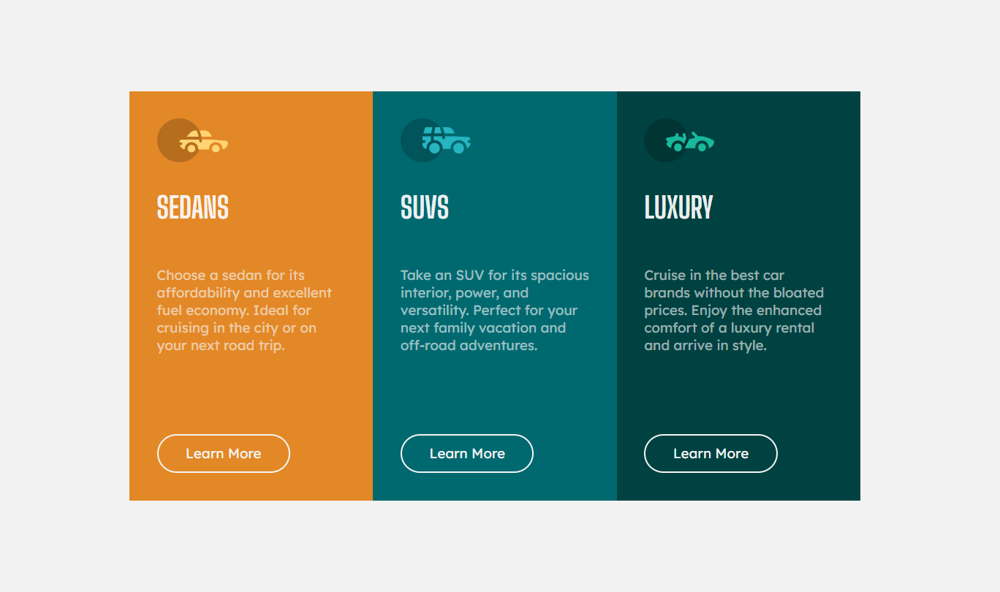

# Three Column Layout

A dynamic and responsive three-column layout built using HTML, CSS, and JavaScript. This project demonstrates how to manipulate the DOM using JavaScript to create interactive and adaptive components.

## Table of Contents
- [Demo](#demo)
- [Features](#features)
- [Technologies Used](#technologies-used)
- [Installation](#installation)
- [Usage](#usage)
- [Screenshot](#screenshot)
- [License](#license)
- [Contact](#contact)

## Demo

Check out the live demo: [Three Column Layout Demo](#) *(Replace `#` with the actual link if available)*

## Features

- Responsive three-column layout adaptable to various screen sizes.
- JavaScript-driven dynamic content generation.
- Interactive elements that enhance user experience.

## Technologies Used

- **HTML5**: For structuring the layout.
- **CSS3**: For styling and responsive design.
- **JavaScript**: For dynamically manipulating the DOM and creating interactive features.

## Installation

1. Clone the repository:

    ```bash
    git clone https://github.com/bkrcokan13/three-column.github.io.git
    cd three-column.github.io
    ```

2. Open `index.html` in your browser. (You can use extensions like **Live Server** for Visual Studio Code to launch a local development server for easier testing and development.)

## Usage

1. Open the `index.html` file in your browser to view the three-column layout.
2. The layout dynamically adjusts and the content is generated using JavaScript. Inspect the code to see how different elements are manipulated and inserted into the DOM.

## Screenshot

Here is a screenshot of the Three Column Layout:

 *(Make sure to add a screenshot image to your repo and update the path accordingly)*

## License

This project is licensed under the MIT License - see the [LICENSE](LICENSE) file for details.

## Contact

Created by [Okan Bakırcı](https://github.com/bkrcokan13) - feel free to contact me!
